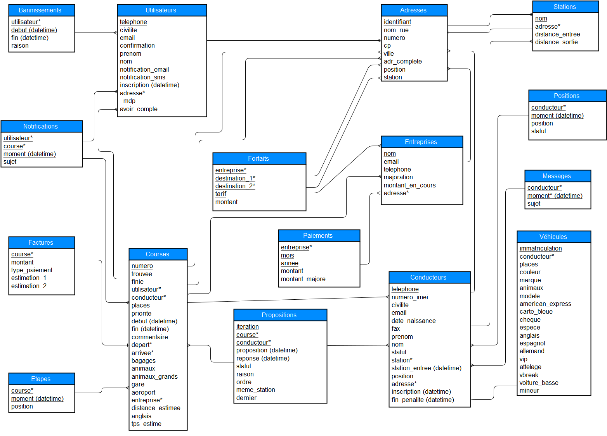

## Base de données

### Description de la BD

Lorsqu’un utilisateur fait sa demande pour un taxi dans un formulaire, une course est créée. Pour cette course, plusieurs propositions sont faites avec des conducteurs différents. Un devis est calculé et est à valider par l’utilisateur. Si c’est le cas la facture s’enregistre dans la table Factures et une notification par sms et par mail alerte le client dès qu’un conducteur lui est attribué. Ceci est enregistré dans la table Notifications. 

Chaque conducteur possède son propre véhicule. Il peut envoyer des messages et recevoir des pénalités s’il ne répond pas favorablement à 5 propositions consécutives alors qu’il est libre. Sa position instantanée est également enregistrée. 
Un utilisateur peut être banni, si c’est le cas sa demande n’est pas prise en compte. Un utilisateur peut au contraire avoir des destinations habituelles, qui seront alors proposées en pré-saisie dans le formulaire. Chaque adresse (de départ ou d’arrivée) correspond à une station ET à un secteur.

Un client VIP peut demander un conducteur préférentiel.

### Schéma de la BD

### Utilisateurs

- Un utilisateur est défini par son numéro de téléphone.
- L'adresse email est aussi unique.
- Un utilisateur confirmé peut se connecter au site.
- Un utilisateur peut avoir un type (privilégié, client régulier, ...)
- L'utilisateur peut choisir si on le notifie par email et/ou par SMS dans son espace client.

### Notifications

C'est ici que l'on stocke les notifications envoyés aux utilisateurs. Une notification est seulement un fait dans le temps, elle est relative à un utilisateur pour une course. Lors du déroulement d'une course, l'utilisateur peut recevoir plusieurs notifications (avec des sujets différents). Les notifications se font par email et/ou SMS, c'est à l'utilisateur de le définir dans son espace client.

### Banissements

Les utilisateurs peuvent être "bannis" du système pour une certaine période. Pour garder un historique des banissements, il faut créer une table. Un banissement a une date de début et une date de fin.

### Habitudes

Lorsqu'un utilisateur va effectuer une course, on va sauvegarder l'adresse de départ en mémoire pour pouvoir la lui proposer aux prochains remplissages de formulaires.

### Conducteurs

- Un conducteur est défini par son numéro de téléphone.
- Le conducteur est assigné à une *station*.
- Le conducteur a un véhicule.
- Le conducteur peut refuser des courses.
- Le conducteur peut recevoir des messages de la société.
- Le conducteur a plusieurs
- Par souci de normalistation on garde la position actuelle du conducteur.

### Pénalités

Un conducteur peut être pénaliser s'il a refusé trop de propositons de courses.

### Messages

C'est ici qu'on stocke tous les SMS que la centrale aux conducteurs.

### Positions

La position géographique d'un conducteur à un moment dans le temps.

### Véhicules

Un véhicule appartient à un conducteur.

### Privilèges

Un utilisateur peut avoir *une* préférence pour *plusieurs* certain conducteur, et vice-versa. La relation *Privilèges* est donc un produit cartésien qui requiert une table intermédiaire.

### Adresses

L'idée c'est qu'un utilisateur va rentrer une adresse textuelle dans un formulaire. On va ensuite la transformer en localisation (latitude, longitude), en d'autres termes la *géolocaliser*. La géolocalisation est une opération lourde. On va donc stocker les adresses au fur et à mesure dans une table. Cela nous permettra de

- Proposer à l'utilisateur des adresses auxquelles il est habitué lorsqu'il remplit le formulaire.
- Faire des analyses statistiques en fonction d'une adresse textuelle.

### Stations

- Une station est assigné à secteur.
- Une station contient plusieurs conducteurs.
- Une station a une zone d'action qui est définie par un rayon.

### Secteurs

Les secteurs sont définis par des polygones, qui sont concrètement une liste de positions géographiques.

### Courses

- Une course se fait pour un utilisateur et par un conducteur.
- Une course peut être un aller-retour ou pas.
- Dans le cas d'un aller-retour l'adresse de départ est la même que celle d'arrivée.
- Une course peut être prioritaire ou pas, par exemple elle l'est pour un client régulier.
- Une course a un attribut *Statut* pour indiquer si elle est finie ou pas, c'est le conducteur qui notifie que la course est finie via son portable.

Lorque l'utilisateur remplit et valide le formulaire, la demande de course est en fait une ligne de table *Courses* incomplète. En effet, c'est à nous de trouve un conducteur adéquat. On peut le faire

- de façon programmatique *avant* d'insérer la ligne dans la base de données.
- avec un trigger SQL *après* que la ligne soit insérée.

Dans tous les cas, l'assignation d'un conducteur à une course doit se faire seulement 10 minutes avant le début de la course.

### Etapes

Contient toutes les étapes d'une course dans le temps.

### Propositions

Lorqu'une une demande est faite par l'utilisateur, on va associer des conducteurs disponibles à la course. Concrètement on générer des tuples (conducteur, course, datetime). A partir de là, on va pouvoir créer une API à laquelle l'application portable du conducteur pourra s'authentifier via son numéro de téléphone. Une proposition peut être faite plusieurs fois à un même conducteur, pour chaque proposition on stocke l'heure d'acceptation/refus et le statut de la proposition.

### Factures

- Chaque course a une facture associée.
- Lorsque l'utilisateur fait une demande de course, on lui fournit une estimation du montant de la course.
- Une facture peut avoir un rabais en fonction du type de client.
- Une facture a un forfait selon l'heure de la journée ou bien la journée de la semaine.

## Choix du SGBD

Nous utiliserons [PostgreSQL](http://www.postgresql.org/). C'est le choix opensource le plus complet, qui contient en plus [PostGIS](http://www.postgis.fr/) une cartouche spatiale qui nous très utile pour faire du calcul de distance ou bien vérifier qu'un point est dans une surface. PostgreSQL nécessite une installation.

[SQLite](https://www.sqlite.org/) est aussi une option valable, cependant il ne gère pas bien les accès concurrents et on aura donc du mal à l'utiliser en production. De plus, la librairie GeoAlchemy2 de Python ne le supporte pas.

## Mise en place

- [Téléchargez la version **9.4.5**](http://www.postgresql.org/download/).
- Vous avez maintenant accès à l'utilitaire graphique Stack Builder qui permet de télécharger la cartouche spatiale PostGis.

Le mot de passe que vous choisissez lors de l'installation est à mettre dans le ``SQLALCHEMY_DATABASE_URI`` du script ``config.py``. De même si vous choisissez un autre port que le 5432 (c'est celui par défault) il faudra le préciser.

- Créez la base de données et les relations en lancant le script ``creation.py``.
- Pour supprimer la base de données il suffit de lancer le script ``suppression.py``.
